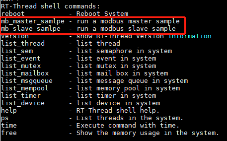
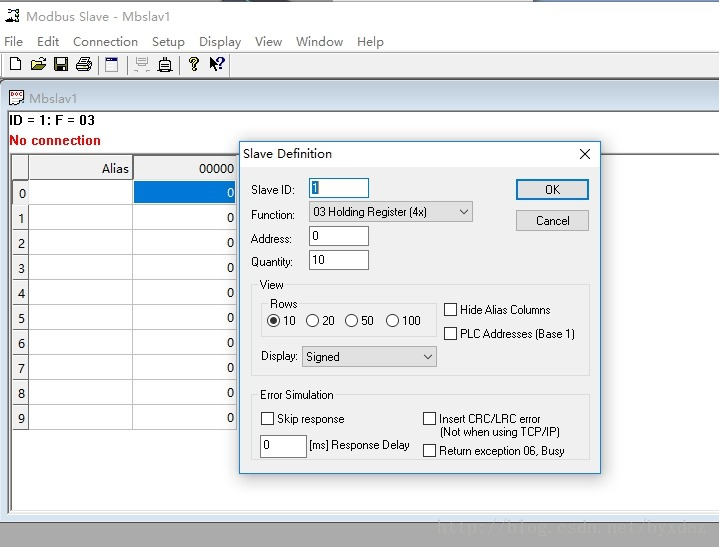
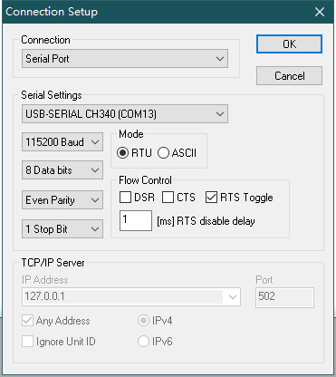
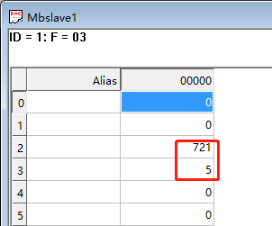

# 示例代码说明

## 运行方法

### 配置工程

使用 Freemodbus  软件包示例代码，需要在 RT-Thread 的包管理器中选择它，并根据需要进行配置，具体路径如下：

```
RT-Thread online packages
    IoT - internet of things --->
        [*] FreeModbus: Modbus master and slave stack  --->
             [*]   Master mode  --->
                 [*]   Enable RTU master mode
                 [*]     Enable master sample
                 (1)       Test slave device address
                 (2)       uart number used by master sample, e.g. 2 means uart2
                 (115200)  uart baudrate used by master sample
             [*]   Slave mode  --->
                 [*]   Enable RTU slave mode
                 [ ]   Enable ASCII slave mode
                 [ ]   Use Contorl Pin
                 [*]   Enable slave sample
                 (1)     Slave device address
                 (2)     uart number used by slave sample, e.g. 2 means uart2
                 (115200) uart baudrate used by slave sample
```

添加示例代码到工程中，并编译下载之后，可以在控制台中看到这两个命令，分别是 Modbus 主机和从机的示例代码。要看代码运行的效果还需要 PC 端 Modbus Poll 和 Modbus slave 这两个软件的配合。



### 运行主机示例

首先下载安装和主机示例代码配合的 Modbus slave 软件。

然后，在命令行输入 `mb_master_samlpe` 命令就可以运行主机的示例代码。

运行之后，打开 Modbus slave 软件，点击菜单“Setup”中“Slave Definition.. F2”进行参数设置。



点击菜单“Connection”中“Connect.. F3”进行连接。弹出连接对话框，根据具体情况配置：



连接成功，可以看到寄存器列表中的第 2、3个寄存器的数值在不断变化。



### 运行从机示例

从机的运行示例和主机相差不大，只是 PC 端配合调试的软件，换成 Modbus Poll 即可。不再赘述。

## 注意事项

- 暂无
